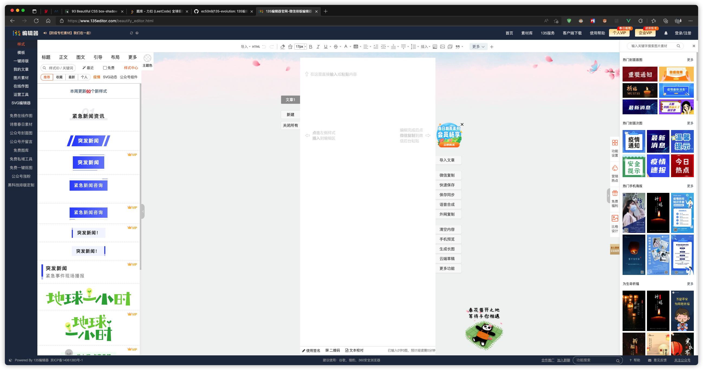
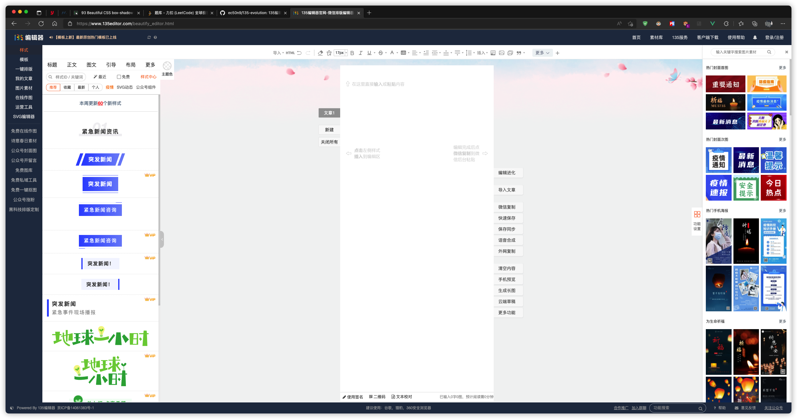
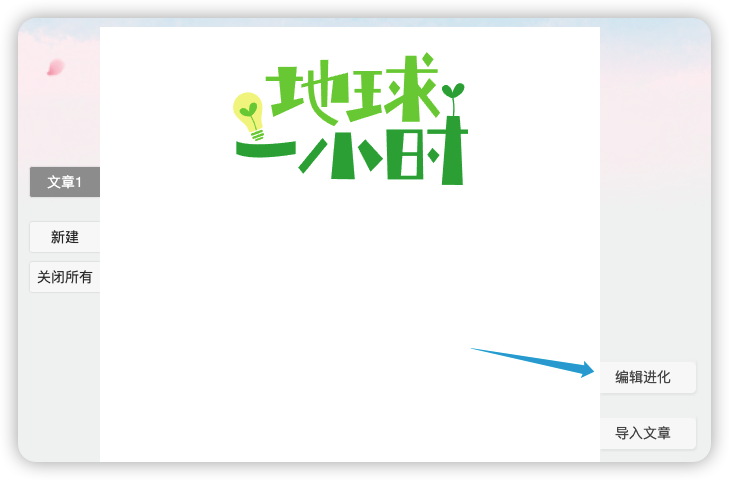
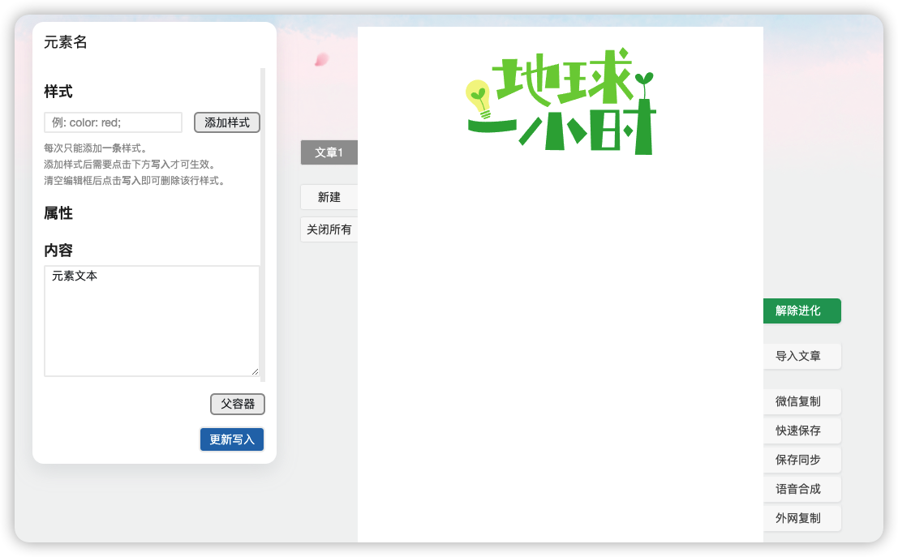
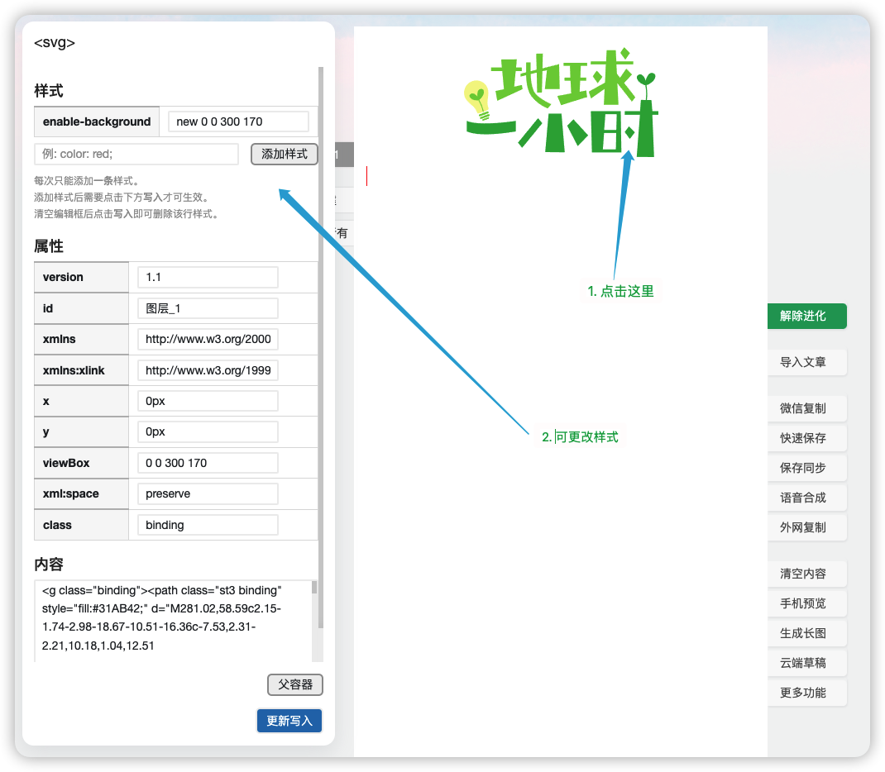
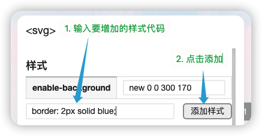
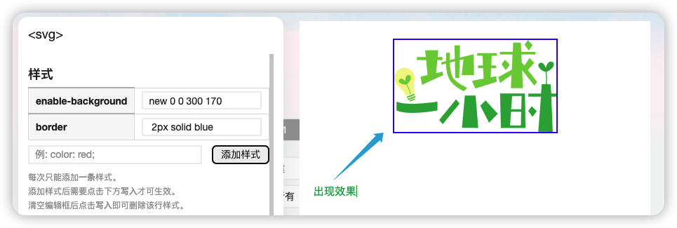
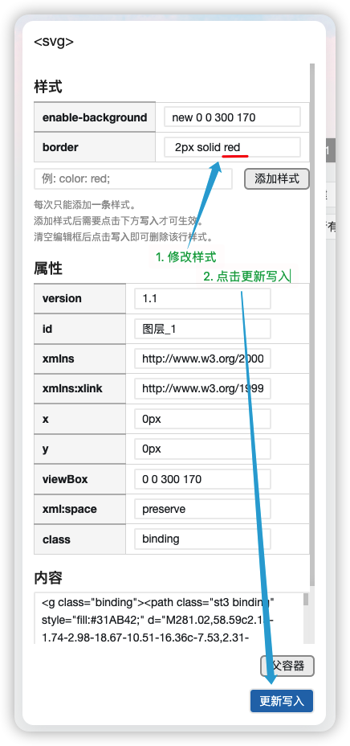
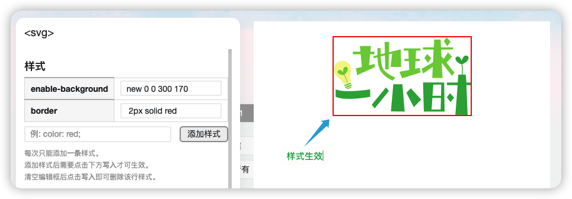
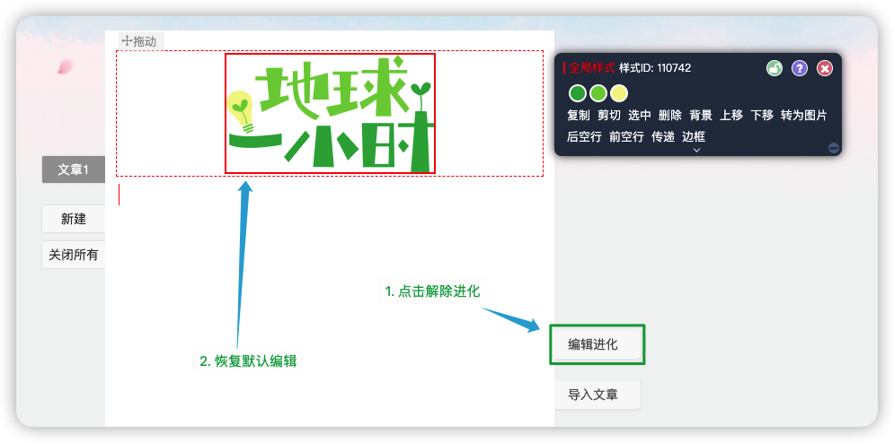

# 135-evolution

135编辑器的增强脚本

## 功能介绍

* 页面广告去除
* 去除vip样式限制，可直接使用
* 去除编辑器非会员只能开2个选项卡限制
* 增加自制简单css编辑器

## 使用截图

开启前：

开启后：

## 增强编辑器

先添加需要编辑的样式到文章上：

点击“编辑进化”按钮🧬 ：

点击选择需要更改样式的元素，然后再添加样式：

在添加样式输入框中输入CSS代码，然后点击添加样式：

样式生效：

修改样式：

样式生效：

退回默认编辑器：

